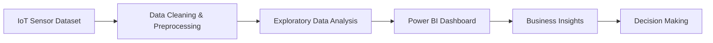
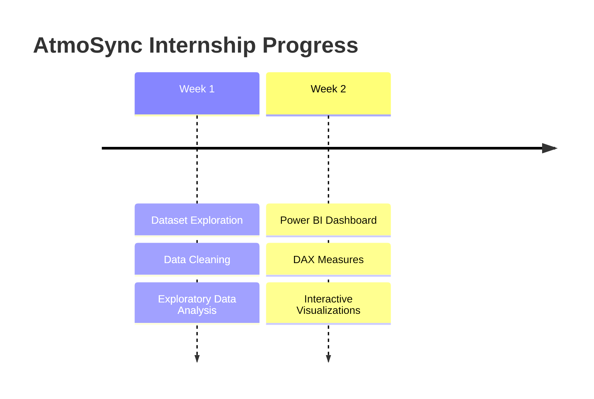
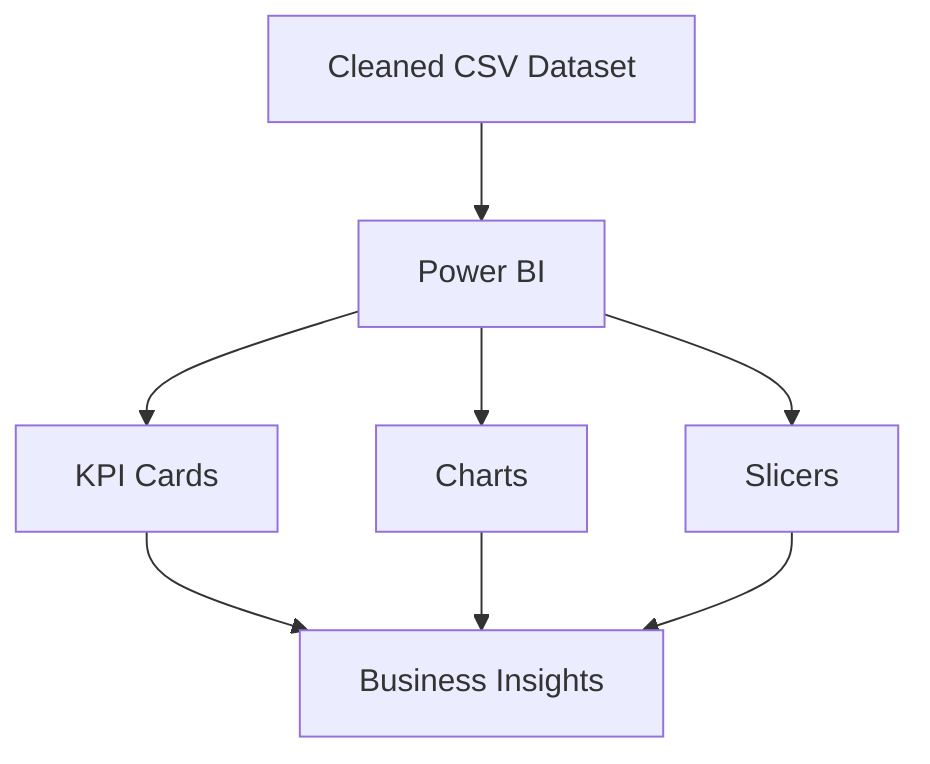
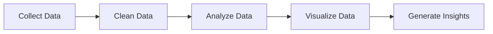

# 🥑🍓🍇 AtmoSync

### Micro-Climate Arbitrage Analytics

*IoT Cold Chain Monitoring & Business Intelligence Dashboard*

My Team Members : Mameeth C Aparna V Malavika Nair Lucky Aswal 

Infotact Data Analytics Project | Week 1 Report

Real-time IoT sensor analytics to detect in-transit commodity spoilage and identify profitable reroute ("arbitrage") opportunities before goods degrade below quality thresholds.

## 📁 Dataset Description

The AtmoSync dataset contains IoT sensor readings collected from refrigerated shipping containers transporting perishable commodities. The dataset includes environmental conditions, shipment details, quality metrics, and operational information used to monitor cold chain performance.

### Key Attributes

- Container ID
  
- Timestamp
  
- Commodity
  
- Temperature
  
- Humidity
  
- Quality Score
  
- Risk Status
  
- Origin Port
 
- Cooling Unit Status
 
- Arbitrage Gain

  ## 🔄 Project Workflow

## 📅 Project Timeline

2️⃣ Dashboard Architecture
## 🏗 Dashboard Architecture

3️⃣ Data Analytics Lifecycle
## 📈 Data Analytics Lifecycle

#✅Week 1: Data Cleaning & Preprocessing

##📌 Project Overview

AtmoSync is an IoT-based analytics project designed to monitor refrigerated shipping containers using sensor data. The objective is to prepare high-quality data for spoilage risk prediction and logistics analysis by performing data cleaning, validation, and exploratory analysis.

##🎯 Week 1 Objectives

Import and explore the IoT sensor dataset

Perform data quality assessment

Handle missing values and duplicate records

Convert appropriate columns to correct data types

Standardize text fields

Validate business rules

Generate basic visualizations

Export a cleaned dataset for further analysis

🛠 Technologies Used

Python

Pandas

Matplotlib

Jupyter Notebook

#📂 Dataset Features

The dataset contains information related to:

Container Details

Commodity Information

Temperature & Humidity Sensors

Transit Details

Shelf Life

Quality Score

Market Prices

Risk Status

Recommended Actions

📊 Visualizations Included

Temperature Distribution

Risk Status Analysis

Top Commodities

Temperature vs Humidity Scatter Plot

# 📊 Exploratory Data Analysis

## 1️⃣ Temperature Distribution

This histogram illustrates the spread of temperature readings collected from refrigerated containers. Most readings fall within the operational range, while a few higher values may indicate potential spoilage risk.

---

## 2️⃣ Risk Status Distribution

This chart displays the number of containers categorized as Low, Medium, and High risk.

---

## 3️⃣ Top Commodities

This visualization shows the commodities that appear most frequently in the shipment dataset.

---

## 4️⃣ Temperature vs Humidity

This scatter plot helps analyze the relationship between container temperature and humidity.

#💡 Business Insights

During the exploratory data analysis of the AtmoSync IoT sensor dataset, several valuable business insights were identified:

1)Monitored refrigerated container conditions using temperature and humidity sensor data.

2)Identified high-risk containers that may require immediate attention to prevent spoilage.

3)Analyzed the distribution of transported commodities to understand shipment patterns.

4)Evaluated product quality scores to assess the overall condition of transported goods.

5)Observed temperature and humidity trends that support better cold chain monitoring.

6)Generated clean and reliable data for building interactive dashboards and future predictive analysis

#🎓 Learning Outcomes
Week 1 of the AtmoSync project provided practical experience in data preprocessing and exploratory data analysis. The key learning outcomes include:

1)Learned how to import and explore real-world IoT datasets using Python.

2)Performed data cleaning by checking missing values, duplicate records, and correcting data types.

3)Applied data preprocessing techniques to improve data quality and consistency.

4)Created meaningful visualizations to identify trends and patterns in the dataset.

5)Understood the importance of data validation before analysis and dashboard development.

6)Improved proficiency in Python, Pandas, Matplotlib, Jupyter Notebook, and GitHub for documenting and managing project work.

📁 Output

The cleaned dataset is exported as:

cleaned_atmosync_dataset.csv

🚀 How to Run This Project

# Install dependencies
pip install pandas numpy matplotlib seaborn

# Run the cleaning pipeline
python scripts/clean_data.py

# Open the analysis notebook
jupyter notebook notebooks/week1_eda_and_cleaning.ipynb

📅 Coming in Week 2

 Build baseline visual dashboards (temperature trends, container routes)
 
 Deeper spoilage-curve modeling per commodity
 
 Merge historical commodity pricing trends
 
 Begin Excel/Power BI-style dashboard mockup for stakeholder review

 Week 2 — Dashboard Visualizations & In-Depth Modeling
 

 📊 Key Findings & Visual Insights (Week 2)
 This dashboard was developed using Microsoft Power BI to visualize and analyze the AtmoSync IoT refrigerated container dataset. It provides interactive insights into container performance, risk levels, temperature monitoring, humidity conditions, and commodity distribution.

 Dashboard Features
 
📦 KPI Cards displaying:

Total Containers

Average Temperature

Average Humidity

Average Quality Score

High Risk Containers

Total Arbitrage Gain

📊 Interactive Visualizations:

Risk Status Distribution

Top Commodities

Temperature Trend

Temperature vs Humidity

Quality Score by Commodity

Origin Port Analysis

Cooling Unit Status

🎛 Interactive Slicers:

Commodity

Origin Port

Technologies Used
Microsoft Power BI

DAX (Data Analysis Expressions)

Data Modeling

Interactive Dashboards

Key Insights

Monitored refrigerated container performance using IoT sensor data.

Compared temperature and humidity patterns across shipments.

Identified high-risk containers requiring immediate attention.

Analyzed commodity distribution and quality scores.

Created a dynamic dashboard with interactive filtering for better decision-making.

DAX Measures Used

Total Containers

Average Temperature

Average Humidity

Average Quality Score

Total Arbitrage Gain

Learning Outcome

This project helped me gain practical experience in:

Building interactive Power BI dashboards.

Creating DAX measures for business metrics.

Designing KPI cards and visualizations.

Implementing dynamic filtering using slicers.

Transforming raw IoT data into meaningful business insights.

💡 Business Insights (Week 2)
The Power BI dashboard transformed the cleaned AtmoSync IoT dataset into an interactive business intelligence solution. Key insights include:

1)Monitored key performance indicators such as average temperature, humidity, quality score, and total containers.

2)Identified high-risk refrigerated containers requiring immediate operational attention.

3)Compared commodity performance based on quality scores and shipment frequency.

4)Evaluated shipment distribution across origin ports for operational planning.

5)Enabled interactive filtering through slicers, allowing users to explore data by commodity, risk status, and location

6)Improved decision-making by presenting real-time insights through dynamic visualizations and KPI cards.

🎓 Learning Outcomes (Week 2)
During Week 2, I gained practical experience in developing an interactive business intelligence dashboard using Microsoft Power BI. The major learning outcomes include:

1)Learned to import and model cleaned datasets in Power BI.

2)Created DAX measures to calculate business KPIs dynamically.

3)Designed interactive KPI cards and multiple visualization types.

4)Implemented slicers to enable dynamic filtering across all dashboard visuals.

5)Understood dashboard design principles, including layout, formatting, and user-friendly visualization.

6)Improved skills in business intelligence, data storytelling, and dashboard development.

7)Enhanced my ability to transform analytical results into meaningful business insights for decision-making.

🚀 Future Improvements
The current dashboard provides interactive analysis of the AtmoSync IoT refrigerated container dataset. In future versions, the project can be enhanced with the following features:
1)Integrate real-time IoT sensor data for live monitoring of refrigerated containers.

2)Develop machine learning models to predict spoilage risk before it occurs.

3)Add automated alerts and notifications for abnormal temperature or humidity levels.

4)Expand the dashboard with advanced analytics such as trend forecasting and anomaly detection.

5)Deploy the dashboard to the Power BI Service for secure online access and sharing.

6)nclude GPS-based route tracking and live container location monitoring.

7)Connect the dashboard to cloud databases for automatic data updates.

8)Add role-based access and customized dashboards for logistics managers and warehouse operators.

9)Improve dashboard performance with optimized data models and additional DAX measures.

10)Enhance the user interface with advanced navigation, drill-through reports, and custom tooltips.

Dashboard PNG

#📅 Week 3 Progress

##🚀 Overview

During Week 3, I focused on enhancing the AtmoSync Power BI dashboard by improving its design, interactivity, and usability. The dashboard was refined to present business insights more effectively while providing a cleaner and more user-friendly experience.

##✅ Work Completed
Improved the overall dashboard layout and visual consistency.

Enhanced KPI cards with better formatting and clear business metrics.

Updated chart titles for improved readability.

Refined dashboard alignment, spacing, and formatting.

Enhanced slicers to provide a better interactive filtering experience.

Improved dashboard aesthetics using consistent colors, fonts, and styling.

Added business-oriented visual elements to improve data interpretation.

Reviewed dashboard visuals to ensure accurate representation of refrigerated container performance.

##📊 Dashboard Enhancements

The dashboard now provides a more intuitive interface for monitoring:

📦 Total Containers

🌡 Average Temperature

💧 Average Humidity

⭐ Average Quality Score

💰 Total Arbitrage Gain

🚢 Commodity Distribution

📍 Origin Port Analysis

📈 Monthly Temperature Trend

⚠ Risk Status Distribution

#💡 Business Insights

The enhanced dashboard allows users to:

Monitor refrigerated container performance more effectively
.
Analyze commodity-wise shipment distribution.

Compare quality scores across different commodities.

Observe temperature trends over time.

Filter data dynamically using interactive slicers.

Support operational decision-making through clear visual analytics.

#Formatted Dashboard

:

📈 Advanced KPI Analysis

During Week 3, additional KPI measures were created in Power BI to provide deeper insights into container risk and overall cold-chain performance.

The following measures were added:

🚨 Critical Containers – identifies the number of unique containers classified as Critical.

⚠️ At-Risk Containers – identifies unique containers requiring closer monitoring.

📊 High Risk Containers % – shows the percentage of containers classified as Critical.

🟢 Container Health % – represents the percentage of containers classified as Normal.

These KPIs provide a quick overview of the current risk and health status of the refrigerated container network.

📊 Business Insights Dashboard

A separate Business Insights page was created in Power BI to provide a more focused view of the analytical results.

The page includes:

📌 Advanced KPI cards

📊 Risk Distribution by Commodity

📋 Container Monitoring Details

📋 Container Monitoring Details

A detailed table was added to display individual container-level information, including:

Container ID

Commodity

Temperature

Humidity

Quality Score

Risk Status

This allows users to examine individual sensor records and understand the conditions associated with different risk levels.

🎨 Conditional Formatting

Conditional formatting was applied to improve the readability of the monitoring table.

Quality scores were visually highlighted based on their values.

Risk statuses were differentiated using appropriate visual indicators.

Critical and At-Risk conditions can therefore be identified more quickly.

This improves the dashboard's usability and helps users focus on containers that may require attention.

🎓 Learning Outcomes

During Week 3, I gained practical experience in:

Creating advanced KPI measures using DAX.

Using DISTINCTCOUNT to identify unique containers.

Developing interactive Power BI dashboards.

Creating business-focused visualizations.

Applying conditional formatting.

Designing detailed monitoring tables.

Improving dashboard usability and visual presentation.

Converting analytical results into meaningful business insights.

🚀 Future Improvements

The following improvements can be considered in future development:

Integrating real-time IoT sensor data.

Developing automated spoilage-risk alerts.

Adding predictive analytics for container risk.

Implementing machine learning-based spoilage prediction.

Adding real-time dashboard refresh.

Expanding the dashboard with additional operational metrics.

# 📅 Week 4 Progress

## 🚀 Overview

During Week 4, I focused on finalizing the AtmoSync project by improving the Power BI dashboard, validating the implemented visuals and measures, and completing the project documentation. The main focus was on making the dashboard more interactive, organized, and presentation-ready.

## ✅ Work Completed

- Finalized the Power BI dashboard layout and visual organization.
- 
- Reviewed and refined KPI cards and dashboard visuals.
- 
- Added navigation between the Main Dashboard and Business Insights pages.
- 
- Tested interactive slicers and dashboard filtering.
- 
- Reviewed DAX measures and KPI calculations for consistency.
- 
- Finalized the Business Insights page with risk analysis and container-level details.
- 
- Improved the readability of tables and visual elements.
- 
- Added final dashboard screenshots to the GitHub repository.
- 
- Updated the README with project progress, insights, learning outcomes, and future improvements.
- 
- Reviewed the complete workflow from data cleaning and EDA to Power BI visualization.

## 🔗 Dashboard Navigation

The Power BI report was organized into two main sections:

- 🏠 **Main Dashboard** – Provides an overall view of container performance and shipment conditions.
- 
- 📊 **Business Insights** – Provides detailed risk analysis, advanced KPIs, and container-level monitoring.
- 

Navigation between the pages was added to provide a smoother user experience.

## 🔍 Validation & Testing

The completed dashboard was reviewed to ensure:

- KPI values are displayed correctly.
- 
- DAX measures provide meaningful results.
- 
- Slicers interact correctly with the visuals.
- 
- Risk categories are represented clearly.
- 
- Tables display relevant container information.
- 
- Dashboard visuals are consistent and easy to understand.

## 💡 Final Business Insights

The final dashboard provides an interactive view of refrigerated container conditions and risk levels. Users can monitor container health, identify Critical and At-Risk containers, analyze risk distribution across commodities, and review temperature, humidity, and quality-score information.

These insights can support better monitoring of refrigerated shipments and help identify containers that may require additional attention.

## 🎓 Learning Outcomes

During Week 4, I strengthened my practical knowledge of:

- Power BI dashboard finalization
- 
- DAX-based KPI analysis
- 
- Interactive dashboard design
- 
- Data validation and testing
- 
- Business insight generation
- 
- Dashboard documentation
- 
- GitHub repository management
- 
- Presenting an end-to-end data analytics project

## 📚 Project Documentation

The GitHub repository was updated with:

- Python data-cleaning notebook
- 
- EDA visualizations
- 
- Power BI dashboard screenshots
- 
- Business insights
- 
- Weekly progress updates
- 
- Learning outcomes
- 
- Future improvements
- 
- Project documentation

## 🔮 Future Improvements

Future development of AtmoSync can include:

- Real-time IoT sensor integration
- 
- Automated spoilage-risk alerts
- 
- Machine learning-based spoilage prediction
- 
- Predictive risk forecasting
- 
- Automated Power BI data refresh
- 
- Integration with live logistics and shipment data

## ⚠️ Risk Analysis Framework

  🌡 Temperature
💧 Humidity
⭐ Quality Score
📦 Commodity
        ↓
   Risk Analysis
        ↓
┌─────────────────────┐
│     Risk Status     │
├─────────────────────┤
│ 🟢 Normal           │
│ 🟡 Watch            │
│ 🟠 At-Risk          │
│ 🔴 Critical         │
└─────────────────────┘
        ↓
⚠️ Monitoring & Business Decision

